[](https://patreon.com/johndoe_)
# Corvid (ˈkɔrvəd)
Corvid is a tool that converts Source Engine maps and their assets to be used in Call of Duty. It is currently in the beta-testing phase. This repository is for developers who know their way around Python and Git. If you are a mapper who wants to use Corvid, go to [releases](https://github.com/KILLTUBE/corvid/releases) to download the latest version.

## Supported games
- Call of Duty 2
- Call of Duty 4: Modern Warfare
- Call of Duty World at War
- Call of Duty Black Ops
- Call of Duty Black Ops 3

## What gets converted
- Brushes (converted as patch meshes to have accurate UVs)
- Displacements and their vertex colors for accurate texture blending
- Rope entities
- Prop entities
   - Static props
   - Physics props
   - Props with different colors
   - Props with different skins
- Light entities
- Sun color & sun angles (doesn't always produce perfect results)
- Materials
   - Color maps
   - Normal maps (excluding ssbump textures)
   - Gloss maps
   - Blend maps
   - Color tints
   - Patch materials (material inheritence)
- 2d skyboxes (converted to equirectangular images for Bo3)
- 3d skyboxes / vistas (requires user to add everything in the 3d skybox in a specific visgroup)

## Work-in-progress features
- Spot lights
- Proper brush conversion for plain brushes
- Overlays (advanced decal entities)

## Currently not supported
- Infected shaders
- Decals (infodecal entities)

# Screenshots
<details>
<summary>Click to toggle</summary>

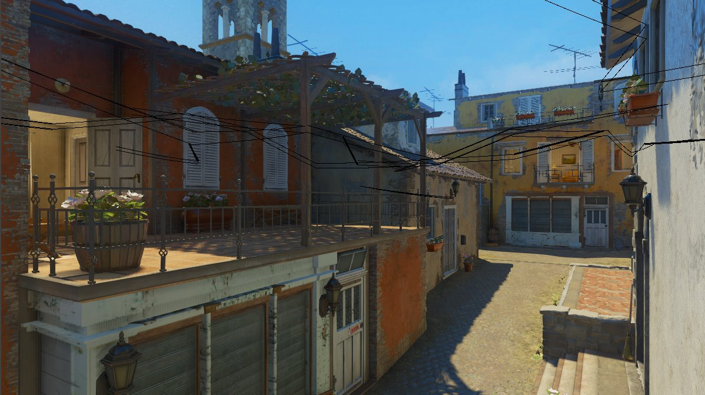
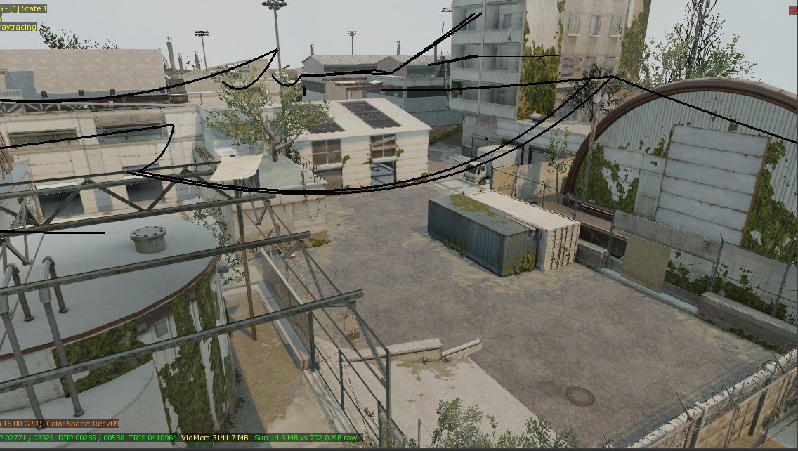
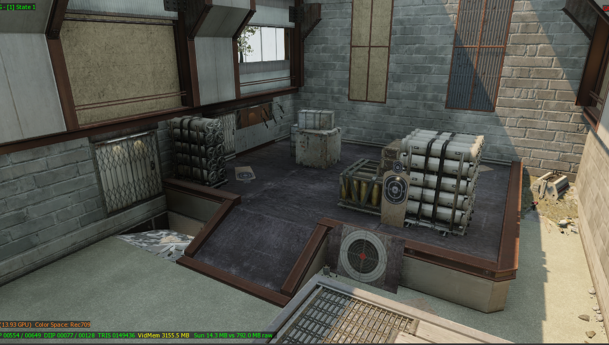
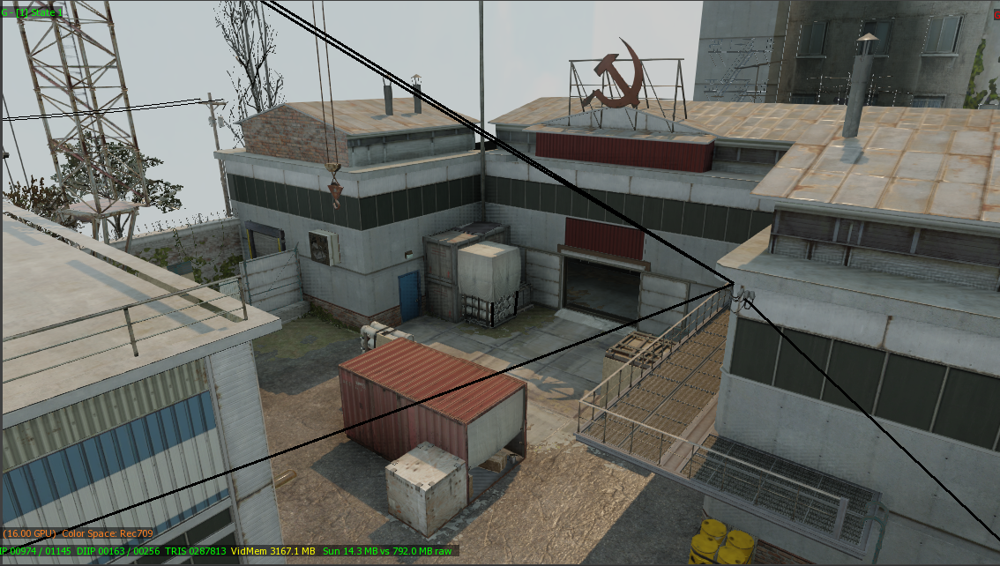
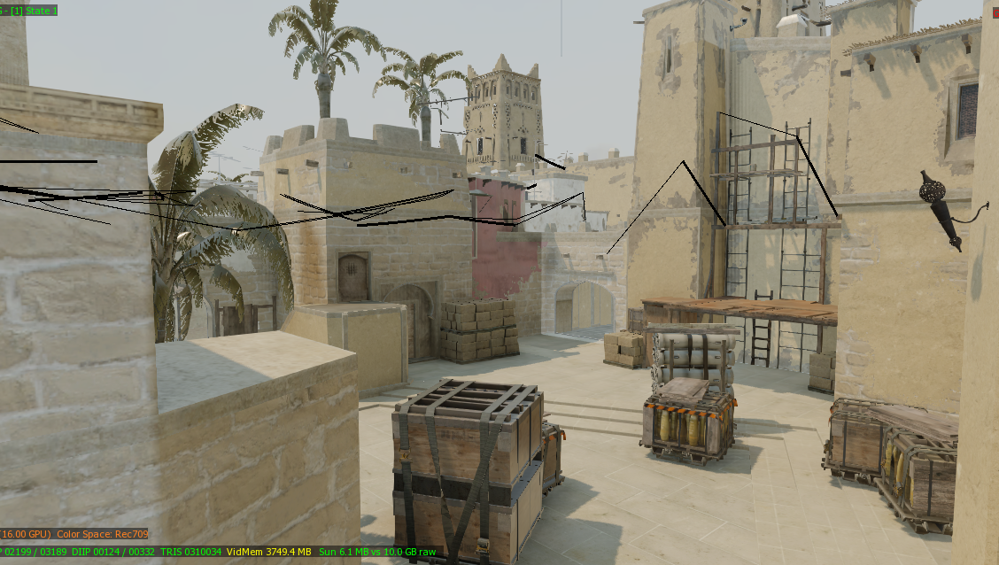
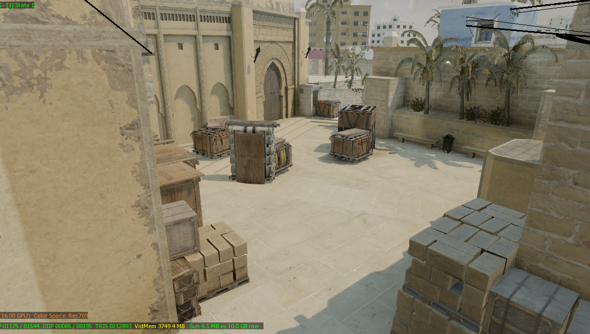
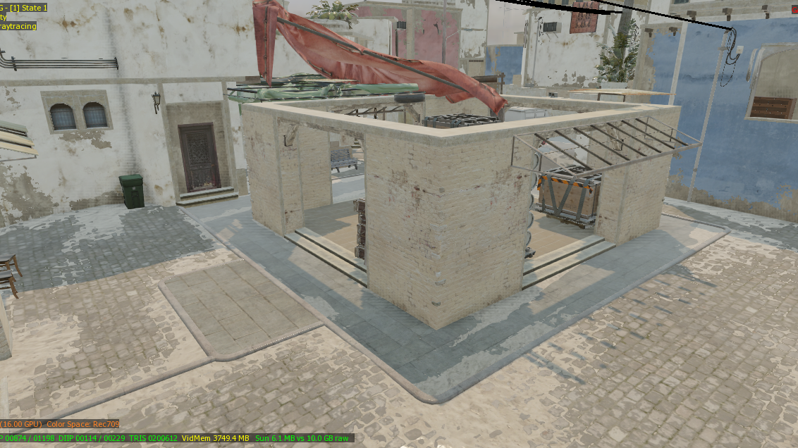
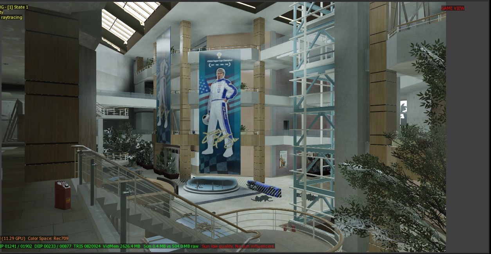
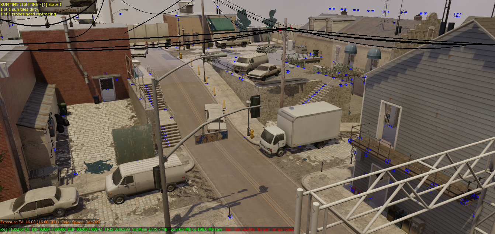
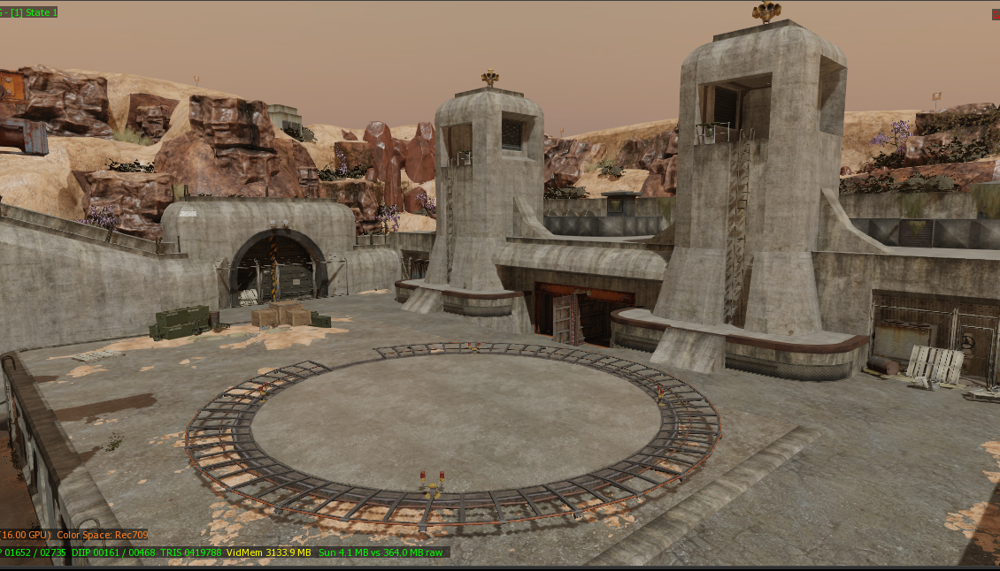
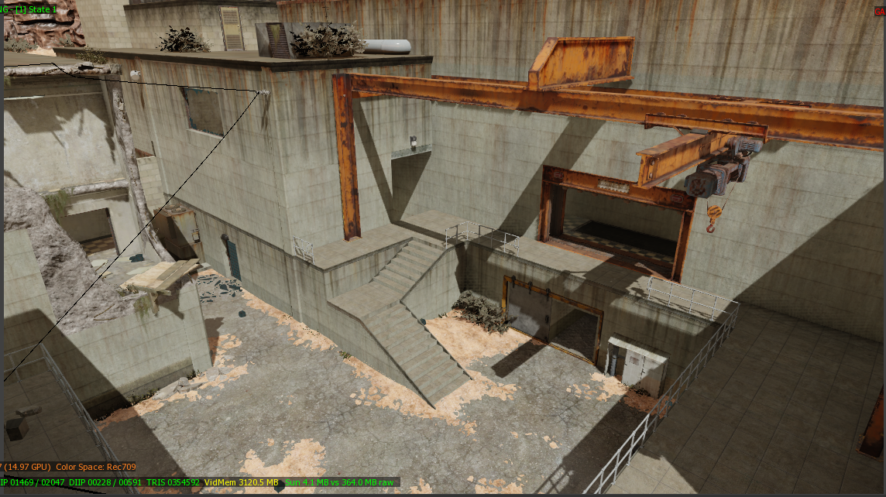
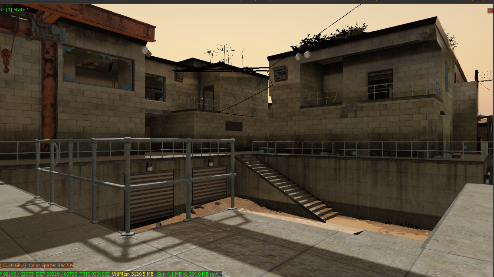
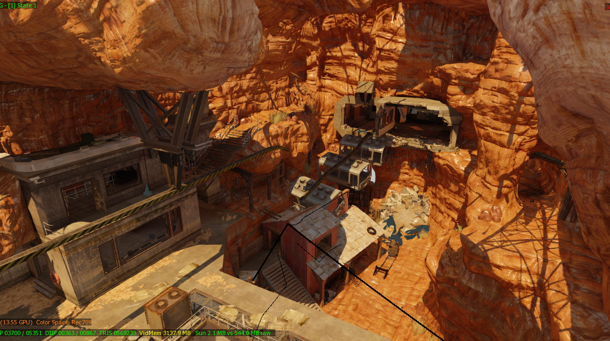
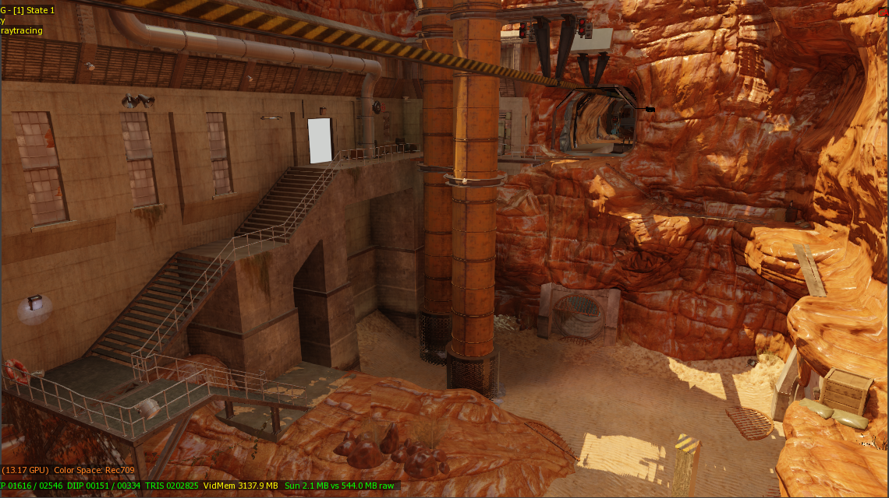
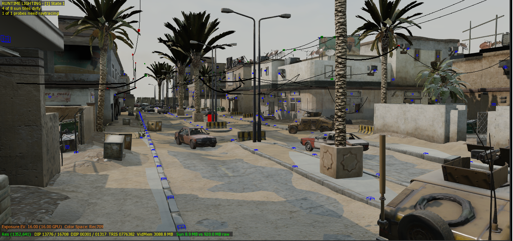

</details>

# Installing & running
## For mappers
Get the latest release from the [releases](https://github.com/KILLTUBE/corvid/releases) section and learn how to use it from the tutorial below.

[](https://www.youtube.com/watch?v=izALMNZjgkA)

## For developers

Clone this repository and its submodules and install the dependencies using the following commands.

```
git clone https://github.com/KILLTUBE/corvid.git --recurse-submodules
python -m pip install -r requirements.txt
```

To run Corvid, launch `app.py`. Choose your Steam director and the game of the map you want to convert, use the VMF file of the map (you can use [BSP Source](https://github.com/ata4/bspsrc/releases) to decompile maps). Once the conversion is done, the map will be ready to be used with its assets properly converted for Call of Duty's mod tools.

## Issues and known bugs
- Some models get converted, but they don't look as they are supposed to (They either have bad normals or look really messed up) and some models cannot get converted at all. This is because of the model converter I wrote. Updating it or using SourceIO's model loader will probably fix that issue.
- Spot lights often have the wrong angles.
- Some assets cannot get copied or converted at all. This is because they are either renamed or removed from the game. There isn't anything that can be done about this apart from adding those assets manually.
- Converted assets might not get copied after the conversion is over if the map has been converted before. Choosing a different directory to extract those assets or deleting the previous ones seems to solve that issue.
- Some brush faces don't get converted for reasons I cannot understand for now. It probably has something to do with the way I check for invalid vertices or slightly incorrect plane calculations.

## Sources and references
- Stefan Hajnoczi's [paper](https://github.com/stefanha/map-files/blob/master/MAPFiles.pdf) on map files.
- [VMF2OBJ](https://github.com/Dylancyclone/VMF2OBJ) by Dylancyclone
- [Qodot](https://github.com/Shfty/qodot-plugin) by Shfty
- [Zeroy](https://zeroy.com)'s article on [Call of Duty map format](https://wiki.zeroy.com/index.php?title=Call_of_Duty_4:_.MAP_file_structure)
- [Valve Map Format](https://developer.valvesoftware.com/wiki/Valve_Map_Format) on [Valve Developer Wiki](https://developer.valvesoftware.com/)

## Third party libraries and references
- [PyCoD](https://github.com/SE2Dev/PyCoD)
- [SourceIO](https://github.com/REDxEYE/SourceIO/)
- [vmf_tool](https://github.com/QtPyHammer-devs/vmf_tool)
- [VDFUtils](https://github.com/darthryking/vdfutils)
- [io_export_qmap](https://github.com/c-d-a/io_export_qmap/)
- [io_import_vmf](https://github.com/lasa01/io_import_vmf)

## Special thanks to
- [Dylancyclone](https://github.com/Dylancyclone) for [VMF2OBJ](https://github.com/Dylancyclone/VMF2OBJ) tool which helped me understand a lot of things about Source Engine maps and inspired me to work on this tool.
- [masterex1000](https://github.com/masterex1000) for helping me understand the intricacies of map files, mesh generation and helping with calculating UV maps.
- Geekidos, HitmanVere, OldmanCats, ThomasCat for testing the maps converted by Corvid and help me figure out the issues we had on Black Ops 3. Without their help, Corvid couldn't have Black Ops 3 support at all.

If you'd like to support my work, you can [become a patron](https://patreon.com/johndoe_) and help me keep working on this tool.

For further information and support, join the KILLTUBE [Discord server](https://discordapp.com/invite/mqBchQZ)

Icon file created by [Freepik](https://www.flaticon.com/authors/freepik)
